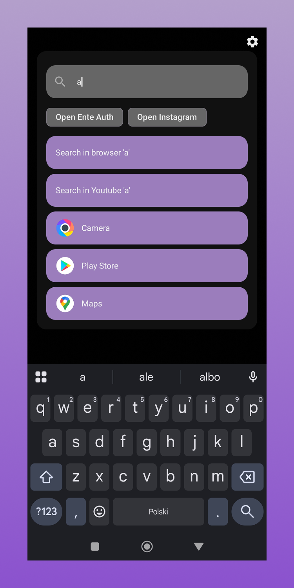
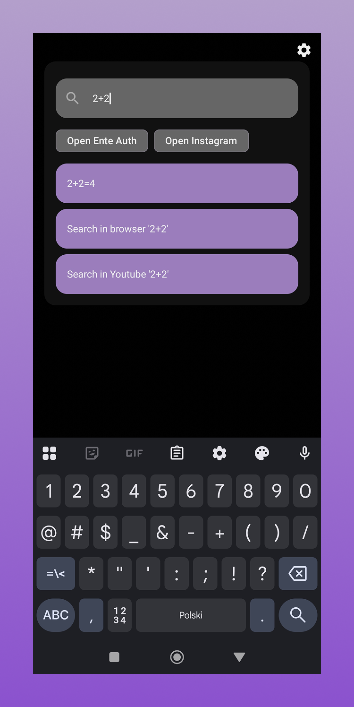
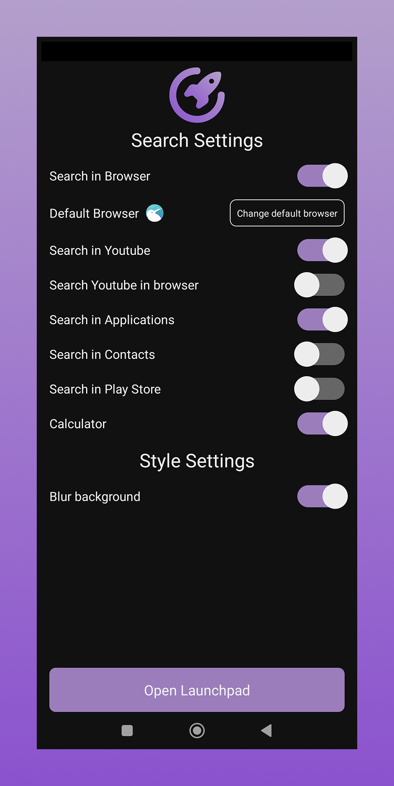

<div align="center">
  
  <h1>Olaunchpad</h1>
  <p>An all-in-one search tool, calculator, and more.<p>
  
</div>

## 🌄 Screenshots

<div align="center" style="display: flex; flex-wrap: wrap; justify-content: center">
  
  
  
</div>

## ⭐ Features

- Search in app list, browser, contacts and many more
- Calculator
- History
- Highly customizable

## 🏗️ Building From Source

1. First you need to get the source code of Olaunchpad

```bash
git clone git@github.com:Brentlok/olaunchpad.git
```

2. Install dependencies

```bash
bun install
```

3. Prebuild native modules

```bash
bun run prebuild
```

4. Build the app or run it in development mode

```bash
# Build the app
bun run build

# Run it in development mode
bun run android
```

## 📁 Structure

```
olaunchpad/
├── modules/launchpad - Native Kotlin module for overlay
└── src/ - React Native app source code
```

## 📋 License

MIT License
